# PydanticAIBaseAgent — Full Class Diagram

Full structural diagram for `akd_ext/agents/_base/pydantic_ai/` traced from the
entry file `_base.py`. Focus: the classes this subpackage adds, the protocols
it defines, and the adapter modules that bridge AKD ↔ pydantic_ai. External
SDK types are shown as single boundary boxes; their internal structure is
captured in the translation tables below, not in the graph.

```mermaid
classDiagram
    direction TB

    %% ══════════════════════════════════════════════════════════
    %% External boundaries (collapsed — details in tables below)
    %% ══════════════════════════════════════════════════════════

    class PAIAgent {
        <<pydantic-ai>>
        +run(prompt, deps, message_history, usage) RunResult
        +run_stream_events(...) AsyncIterator
        +output_validator «decorator»
        +system_prompt «decorator»
    }

    class AbstractCapability {
        <<pydantic-ai>>
    }
    class Hooks {
        <<pydantic-ai>>
        +on.before_model_request
        +on.before_tool_execute
    }
    AbstractCapability <|-- Hooks

    class PAITool {
        <<pydantic-ai>>
        +name / description / function
    }
    class ModelRetry {
        <<pydantic-ai Exception>>
    }
    class AgentRunResultEvent {
        <<pydantic-ai>>
        +result.output
    }

    class ConfigBindingMixin {
        <<akd mixin>>
        +__init_subclass__() auto-exposes config fields as properties
        +skips in-dict redeclarations (e.g. system_prompt)
    }
    class BaseAgentConfig {
        <<akd>>
        +model_name / system_prompt / tools
        +reasoning_effort / num_retries
        +max_tool_iterations / max_tool_calls
        +reflection_prompt / enable_trimming / trim_ratio
    }
    class BaseTool {
        <<akd>>
        +name / description
        +arun / as_function
    }
    class InputSchema {
        <<akd>>
    }
    class OutputSchema {
        <<akd>>
    }
    class TextOutput {
        <<akd>>
    }
    OutputSchema <|-- TextOutput

    class AKDStreamEvent {
        <<akd>>
        +Completed / StreamingToken / Thinking
        +ToolCalling / ToolResult
        +run_context: AKDRunContext
    }

    class AKDRunContext {
        <<akd>>
        +messages: list[dict] | None
        +usage: RunUsage
        +run_id: str | None
        +pai_run_context: pai.RunContext «extra / lossless»
    }

    %% ══════════════════════════════════════════════════════════
    %% Protocols (akd._base.protocols)
    %% ══════════════════════════════════════════════════════════

    class TokenCounts {
        <<Protocol>>
        +input_tokens / output_tokens / requests
    }
    class RunContextProtocol {
        <<Protocol>>
        +messages / usage / run_id
    }
    class AKDExecutable {
        <<Protocol>>
        +input_schema / output_schema / config_schema
        +name / description
        +arun(params, run_context) Any
        +astream(params, run_context) AsyncIterator
    }
    class AKDTool {
        <<Protocol>>
        +name / description
        +as_function() Callable
    }
    AKDExecutable <|-- AKDTool
    RunContextProtocol ..> TokenCounts

    %% ══════════════════════════════════════════════════════════
    %% Adapter / bridge modules (_*.py) — function-only
    %% ══════════════════════════════════════════════════════════

    class ContextAdapter {
        <<_context_adapter.py>>
        +_akd_dicts_to_pai_messages(msgs)$ list
        +_usage_to_pai(usage)$ PAIRunUsage
        +_pai_messages_to_akd_dicts(msgs)$ list[dict]
        +_pai_usage_to_akd_usage(pai_usage)$ AKDRunUsage
        +_message_history_from_run_context(ctx)$ list
        +_usage_from_run_context(ctx)$ PAIRunUsage
    }
    class EventTranslator {
        <<_event_translator.py>>
        +pai_event_to_akd_event(event, run_context=None)$ AKDStreamEvent
    }
    class ToolAdapter {
        <<_tool_adapter.py>>
        +akd_to_pai_tool(tool)$ PAITool
    }
    class CapabilityFactories {
        <<_capabilities.py>>
        +ToolCallLimits(max_iterations, max_calls)$ Hooks
        +ReflectionCapability(prompt)$ Hooks
        +make_ratio_trimmer(ratio)$ Callable
    }

    %% ══════════════════════════════════════════════════════════
    %% Config + Core (_base.py)
    %% ══════════════════════════════════════════════════════════

    class PydanticAIBaseAgentConfig {
        +capabilities: list
        +history_processors: list
        +enable_trimming: bool
        +extra allowed for forward-compat
    }
    BaseAgentConfig <|-- PydanticAIBaseAgentConfig

    class PydanticAIBaseAgent~InSchema OutSchema~ {
        +input_schema: type
        +output_schema: type
        +config_schema: type
        +config: PydanticAIBaseAgentConfig
        +_live_pai_ctx: Any
        ── AKD contract ──
        +arun(params, run_context) OutSchema
        +astream(params, run_context) AsyncIterator
        ── RunContext propagation ──
        +_build_run_context_capture() Hooks
        +_wrap_pai_ctx() AKDRunContext
        +last_run_context AKDRunContext? «property»
        ── hooks ──
        +_to_prompt(params) str
        +_deps_from_run_context(ctx) Any
        +_build_capabilities_from_scalars() list
        +_build_history_processors_from_scalars() list
        +_adapt_tools(tools) list
        +check_output(output) str
    }

    %% ── Inheritance / conformance ─────────────────────────────
    ConfigBindingMixin <|-- PydanticAIBaseAgent
    PAIAgent <|-- PydanticAIBaseAgent
    AKDExecutable <|.. PydanticAIBaseAgent

    %% ── Composition ───────────────────────────────────────────
    PydanticAIBaseAgent --> PydanticAIBaseAgentConfig : config
    PydanticAIBaseAgent --> AKDRunContext : wraps live pai ctx
    PydanticAIBaseAgent --> Hooks : installs ctx_capture

    %% ── Adapter usage (one edge per bridge module) ────────────
    PydanticAIBaseAgent ..> ContextAdapter : uses
    PydanticAIBaseAgent ..> EventTranslator : uses
    PydanticAIBaseAgent ..> ToolAdapter : uses
    PydanticAIBaseAgent ..> CapabilityFactories : uses

    %% ── Adapters target their respective external types ──────
    ContextAdapter ..> RunContextProtocol : accepts
    ContextAdapter ..> AKDRunContext : reads pai_run_context extra
    EventTranslator ..> AKDStreamEvent : produces
    EventTranslator ..> AgentRunResultEvent : consumes (terminal)
    EventTranslator ..> AKDRunContext : attaches to events
    ToolAdapter ..> AKDTool : accepts
    ToolAdapter ..> PAITool : produces
    ToolAdapter ..> ModelRetry : raises
    CapabilityFactories ..> Hooks : returns
    CapabilityFactories ..> AbstractCapability : (Thinking) returns

    %% Base agent surfaces BaseTool via _adapt_tools
    PydanticAIBaseAgent ..> BaseTool : isinstance (adapt)
    PydanticAIBaseAgent ..> TextOutput : passthrough in check_output
    PydanticAIBaseAgent ..> ModelRetry : raises in validator

    %% ══════════════════════════════════════════════════════════
    %% Styling
    %% ══════════════════════════════════════════════════════════

    %% Core new classes — green
    style PydanticAIBaseAgent fill:#e8f5e9,stroke:#2e7d32
    style PydanticAIBaseAgentConfig fill:#e8f5e9,stroke:#2e7d32

    %% Protocols — orange
    style TokenCounts fill:#fff3e0,stroke:#e65100
    style RunContextProtocol fill:#fff3e0,stroke:#e65100
    style AKDExecutable fill:#fff3e0,stroke:#e65100
    style AKDTool fill:#fff3e0,stroke:#e65100

    %% Adapters / Bridges — pink
    style ContextAdapter fill:#fce4ec,stroke:#c62828
    style EventTranslator fill:#fce4ec,stroke:#c62828
    style ToolAdapter fill:#fce4ec,stroke:#c62828
    style CapabilityFactories fill:#fce4ec,stroke:#c62828

    %% External pydantic_ai — blue
    style PAIAgent fill:#e3f2fd,stroke:#1565c0
    style AbstractCapability fill:#e3f2fd,stroke:#1565c0
    style Hooks fill:#e3f2fd,stroke:#1565c0
    style PAITool fill:#e3f2fd,stroke:#1565c0
    style ModelRetry fill:#e3f2fd,stroke:#1565c0
    style AgentRunResultEvent fill:#e3f2fd,stroke:#1565c0

    %% External akd-core — gray
    style ConfigBindingMixin fill:#eceff1,stroke:#455a64
    style BaseAgentConfig fill:#eceff1,stroke:#455a64
    style BaseTool fill:#eceff1,stroke:#455a64
    style InputSchema fill:#eceff1,stroke:#455a64
    style OutputSchema fill:#eceff1,stroke:#455a64
    style TextOutput fill:#eceff1,stroke:#455a64
    style AKDStreamEvent fill:#eceff1,stroke:#455a64
    style AKDRunContext fill:#eceff1,stroke:#455a64
```



## Module Layout

```
akd_ext/agents/_base/pydantic_ai/
├── __init__.py              # re-exports PydanticAIBaseAgent, PydanticAIBaseAgentConfig
├── _base.py                 # PydanticAIBaseAgent, PydanticAIBaseAgentConfig
├── _capabilities.py         # ToolCallLimits, ReflectionCapability, make_ratio_trimmer (factories)
├── _context_adapter.py      # AKD ↔ pydantic_ai run-context / message-history / usage translation
├── _event_translator.py     # pai_event_to_akd_event — stream event mapping
└── _tool_adapter.py         # akd_to_pai_tool — BaseTool → pydantic_ai.Tool
```

Structural protocols (``AKDExecutable``, ``AKDTool``, ``RunContextProtocol``, ``TokenCounts``)
are sourced from ``akd._base.protocols`` and no longer duplicated here.

## Color Legend

| Color | Layer | Meaning |
|-------|-------|---------|
| 🟢 Green (`#e8f5e9`) | Core new classes | The two classes this subpackage adds: `PydanticAIBaseAgent`, `PydanticAIBaseAgentConfig`. |
| 🔵 Blue (`#e3f2fd`) | External — pydantic_ai | Library types being subclassed, composed, or translated. Collapsed to a handful of boundary boxes — internal shape isn't diagrammed. |
| ⚪ Gray (`#eceff1`) | External — akd-core | Foundations from the parent framework — schemas, config base, tool base, stream-event hierarchy, `ConfigBindingMixin`. |
| 🟠 Orange (`#fff3e0`) | Protocols | Structural interfaces defined in `akd._base.protocols`. Runtime-checkable; satisfied by both AKD and pydantic_ai sides. |
| 🩷 Pink (`#fce4ec`) | Adapters / bridges | Function-only modules presented as classes with static methods; each sits between an AKD concept and a pydantic_ai concept. |

## Inheritance & Conformance

```
Runtime (class) inheritance
──────────────────────────
akd.ConfigBindingMixin ──┐
pydantic_ai.Agent        ├──► PydanticAIBaseAgent [Path B]
akd AKDExecutable ───────┘        (Protocol listed in bases so isinstance works)

akd.BaseAgentConfig ──► PydanticAIBaseAgentConfig

Structural (Protocol) conformance
──────────────────────────────────
AKDExecutable  ◄── AKDTool         (both runtime_checkable)
TokenCounts  is satisfied by both akd.RunUsage and pydantic_ai.RunUsage
RunContextProtocol is satisfied by both akd.RunContext and pydantic_ai.RunContext
```

## Key Flows

### `arun(params)` — one-shot inference

```
PydanticAIBaseAgent.arun(params, run_context=?)
 ├─ self._to_prompt(params)                           → str (default: params.model_dump_json)
 ├─ ContextAdapter._message_history_from_run_context  → list[ModelMessage] | None
 │      └─ if msgs are dicts: _akd_dicts_to_pai_messages
 ├─ ContextAdapter._usage_from_run_context            → PAIRunUsage | None
 │      └─ _usage_to_pai (pass-through or copy 3 fields)
 ├─ self._deps_from_run_context(run_context)          → Any | None
 └─ super().run(prompt, deps, message_history, usage, **kwargs)
         └─ (inside pydantic_ai) output_validator: self.check_output
                └─ returns str → raises ModelRetry; returns None → accept
     result.output                                    → OutSchema
```

### `astream(params)` — event stream

```
PydanticAIBaseAgent.astream(params, run_context=None)
 ├─ prompt = self._to_prompt(params)
 └─ async for pai_event in super().run_stream_events(prompt, deps, msg_history, usage):
      ├─ AgentRunResultEvent → yield CompletedEvent(
      │                              data=CompletedEventData(output=...),
      │                              run_context=self._wrap_pai_ctx(),
      │                          )
      └─ else:
            akd_event = EventTranslator.pai_event_to_akd_event(
                           pai_event, run_context=self._wrap_pai_ctx()
                       )
              ├─ PartDeltaEvent(TextPartDelta)      → StreamingTokenEvent
              ├─ PartDeltaEvent(ThinkingPartDelta)  → ThinkingEvent(streaming=True)
              ├─ PartDeltaEvent(ToolCallPartDelta)  → StreamingTokenEvent (args JSON chunk)
              ├─ PartStartEvent(ThinkingPart)       → ThinkingEvent
              ├─ FunctionToolCallEvent              → ToolCallingEvent
              ├─ BuiltinToolCallEvent               → ToolCallingEvent
              ├─ FunctionToolResultEvent            → ToolResultEvent
              ├─ BuiltinToolResultEvent             → ToolResultEvent
              └─ (other)                            → None  (dropped)
```

### `__init__(config)` — construction pipeline

```
PydanticAIBaseAgent.__init__(config)
 ├─ self.config = config or self.config_schema()
 ├─ extra_kwargs = dict(config.model_extra or {})         # forward-compat
 ├─ self._live_pai_ctx = None                             # RunContext capture slot
 ├─ ctx_capture = self._build_run_context_capture()       # Hooks: before_model_request,
 │                                                        #        before_tool_execute
 ├─ super().__init__(PAIAgent, …)
 │    ├─ tools        = self._adapt_tools(config.tools)
 │    │    └─ for each BaseTool: ToolAdapter.akd_to_pai_tool → PAITool
 │    │    └─ else: pass through (already pydantic_ai.Tool)
 │    ├─ capabilities = [ctx_capture,
 │    │                  *self._build_capabilities_from_scalars(),
 │    │                  *config.capabilities]
 │    │    ├─ reasoning_effort        → Thinking(effort=…)
 │    │    ├─ max_tool_iterations /calls → ToolCallLimits(Hooks)
 │    │    └─ reflection_prompt       → ReflectionCapability(Hooks)
 │    └─ history_processors = [*self._build_history_processors_from_scalars(), *config.history_processors]
 │         └─ enable_trimming         → make_ratio_trimmer(1 - trim_ratio)
 └─ self._register_akd_output_validator()     # wires self.check_output via @output_validator
```

### RunContext propagation — Hooks capture and emission

```
At __init__
 └─ self._live_pai_ctx = None
     ctx_capture = Hooks().on.before_model_request / .on.before_tool_execute
     (registered as the first capability on super().__init__)

During a run (hooks fire on each model request / tool execution)
 ├─ before_model_request(ctx, request) → self._live_pai_ctx = ctx; return request
 └─ before_tool_execute(ctx, call, tool_def, args) → self._live_pai_ctx = ctx; return args
        ↑ ctx is pai's live RunContext — a shared reference into GraphAgentState,
          so .messages / .usage / .run_id reflect the latest state between hooks

On stream emission (astream)
 └─ self._wrap_pai_ctx() builds an AKD RunContext per event:
      ├─ messages     = ContextAdapter._pai_messages_to_akd_dicts(pai_ctx.messages)
      ├─ usage        = ContextAdapter._pai_usage_to_akd_usage(pai_ctx.usage)
      ├─ run_id       = pai_ctx.run_id
      └─ pai_run_context = pai_ctx                 # lossless extra for continuation

On input (arun / astream receiving a prior turn's run_context)
 ├─ ContextAdapter._message_history_from_run_context(ctx)
 │    └─ if ctx.pai_run_context: use its .messages verbatim (lossless)
 │       else: convert ctx.messages dicts → ModelMessage (AKD-shape fallback)
 └─ ContextAdapter._usage_from_run_context(ctx)
      └─ if ctx.pai_run_context: use its .usage verbatim
         else: copy 3 structural fields from ctx.usage

For arun callers (return stays OutputSchema)
 └─ agent.last_run_context → self._wrap_pai_ctx()  # None before any run
    Used as: out_1 = await agent.arun(X)
             ctx  = agent.last_run_context
             out_2 = await agent.arun(Y, run_context=ctx)  # multi-turn
```

## Translation / Mapping Tables

### Stream events (pydantic_ai → akd)

| pydantic_ai event | AKD event | Notes |
|---|---|---|
| `PartDeltaEvent(TextPartDelta)` | `StreamingTokenEvent` | `token = delta.content_delta` |
| `PartDeltaEvent(ThinkingPartDelta)` | `ThinkingEvent(streaming=True)` | delta content only |
| `PartDeltaEvent(ToolCallPartDelta)` | `StreamingTokenEvent` | args-JSON chunks surfaced as tokens |
| `PartStartEvent(ThinkingPart)` | `ThinkingEvent` | one-shot, non-streaming |
| `FunctionToolCallEvent` / `BuiltinToolCallEvent` | `ToolCallingEvent` | wraps `ToolCall(tool_call_id, tool_name, arguments)` |
| `FunctionToolResultEvent` / `BuiltinToolResultEvent` | `ToolResultEvent` | wraps `ToolResult(tool_call_id, tool_name, content)` |
| `AgentRunResultEvent` | `CompletedEvent(data=CompletedEventData(output=…))` | emitted by `astream` itself, not by translator |
| `FinalResultEvent`, `PartStartEvent(TextPart)`, `PartEndEvent`, `RetryPromptPart` results | *(dropped — return `None`)* | iterator termination is the end-of-stream signal |

### Run context — input side (caller → pydantic_ai)

| Field | AKD `RunContext` | pydantic_ai `RunContext` | Adapter behavior |
|---|---|---|---|
| `messages` | `list[dict]` (OpenAI-style) | `list[ModelMessage]` (typed) | **Preferred path**: if `ctx.pai_run_context` is present, use `pai_run_context.messages` verbatim (lossless). **Fallback**: dicts → `ModelRequest` / `ModelResponse` via `_akd_dicts_to_pai_messages`; already-typed list passes through. |
| `usage` | `akd.RunUsage` (pydantic BaseModel) | `pydantic_ai.RunUsage` (dataclass) | **Preferred path**: `ctx.pai_run_context.usage` (already `PAIRunUsage`). **Fallback**: copy 3 structural fields from AKD `RunUsage`; rest default to 0. |
| `deps` | (not present) | `Any` | If run_context is a `PAIRunContext` itself, forward `.deps`; else `None`. |
| `run_id` | structural | structural | Read via `RunContextProtocol`, not converted. |

Preferring `pai_run_context` means handing back `event.run_context` verbatim on the next turn "just works": the lossless pai objects round-trip without re-conversion, and the reflected AKD typed fields below are never read as input.

### Run context — output side (pydantic_ai → event.run_context)

Emitted by `PydanticAIBaseAgent._wrap_pai_ctx()` from `self._live_pai_ctx` (the live pai `RunContext` captured by the hooks capability). Populates AKD's typed fields for read-only inspection and carries the lossless pai object under an extra slot:

| AKD `RunContext` field | Source | Helper | Lossiness |
|---|---|---|---|
| `messages` | `pai_ctx.messages` (`list[ModelMessage]`) | `_pai_messages_to_akd_dicts` | Lossy — multi-part responses collapse to OpenAI-style dicts; `ThinkingPart`s prefix-tagged into `content`; `ToolCallPart.args` serialized to JSON strings. |
| `usage` | `pai_ctx.usage` (`PAIRunUsage`) | `_pai_usage_to_akd_usage` | Near-lossless — 3 structural fields exact; overflow fields (cache / audio tokens, `tool_calls`) + pai `details` collapse into AKD `details` dict. |
| `run_id` | `pai_ctx.run_id` | (verbatim) | Lossless. |
| `pai_run_context` (extra) | `pai_ctx` itself | (verbatim) | **Lossless escape hatch** — the full pai `RunContext` preserved intact. Input-side helpers consult this first when it's present. |

### Scalar config → capability

| Config field | Capability / processor | Factory location |
|---|---|---|
| `reasoning_effort` | `Thinking(effort=…)` | built inline in `_build_capabilities_from_scalars` |
| `max_tool_iterations` / `max_tool_calls` | `ToolCallLimits` (`Hooks` with `before_model_request` / `before_tool_execute`) | `_capabilities.ToolCallLimits` |
| `reflection_prompt` | `ReflectionCapability` (`Hooks` with `before_model_request`) | `_capabilities.ReflectionCapability` |
| `enable_trimming` (+ `trim_ratio`) | stateless history processor (keeps head, drops oldest fraction) | `_capabilities.make_ratio_trimmer` |

### AKD tool → pydantic_ai tool (`akd_to_pai_tool`)

| Step | Source (AKD) | Target (pydantic_ai) |
|---|---|---|
| 1. Get callable | `BaseTool.as_function()` | — |
| 2. Wrap | catch `pydantic.ValidationError` / `akd.SchemaValidationError` | raise `ModelRetry(str(e))` |
| 3. Preserve metadata | `__signature__`, `__annotations__`, `__name__`, `__doc__` | forwarded onto wrapper |
| 4. Construct | `name = akd_tool.name`, `description = akd_tool.description or cls.__doc__` | `pydantic_ai.Tool(wrapped, name, description)` |

## Design Notes

- **Path B** (subclassing `PAIAgent` directly) keeps this implementation lean.
  `AKDExecutable` is also listed in the bases so `isinstance(agent, AKDExecutable)`
  returns `True` at runtime. Swapping to Path A (multi-inheriting `BaseAgent` for
  shared machinery) is a small diff if ever needed.
- **Config auto-exposure** uses akd-core's `ConfigBindingMixin` (a mixin driven
  by `__init_subclass__`, no metaclass). Fields already defined in the class
  dict are skipped automatically — we re-bind `system_prompt = PAIAgent.system_prompt`
  at class scope to prevent the auto-property from shadowing pydantic_ai's
  `system_prompt` decorator method.
- **RunContext propagation** pairs a `Hooks`-capability capture of pai's live
  `RunContext` (stored on `self._live_pai_ctx`) with `_wrap_pai_ctx()` emission.
  Every stream event carries an AKD `RunContext` whose typed fields reflect
  pai state (lossy but inspectable) and whose `pai_run_context` extra holds
  the lossless pai object. Input-side helpers prefer the extra when present,
  so callers round-trip `event.run_context` verbatim. `arun` keeps its
  `OutputSchema` return contract; `agent.last_run_context` exposes the same
  wrapped context for multi-turn continuation. **Concurrency caveat**:
  `_live_pai_ctx` is instance-scoped, so concurrent `arun` / `astream` calls on
  one agent will race — use a fresh agent per run or move to the queue-based
  `event_stream_handler` design (tracked follow-up).
- **Trimming is off by default** on `PydanticAIBaseAgentConfig`: the naive
  ratio-trimmer breaks pydantic_ai's invariant that every `tool` message must
  follow an `assistant` with matching `tool_calls`. A pydantic_ai-aware
  trimmer is a follow-up.
- **Litellm validators are silenced**: `BaseAgentConfig`'s model_validator
  hooks call `litellm.get_model_info`, which expects bare model names, not
  `provider:model`. Both are overridden to no-ops.
